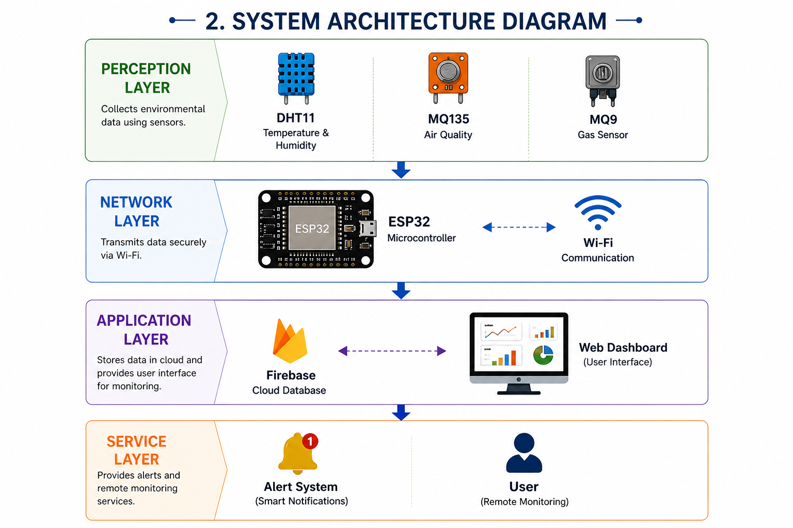
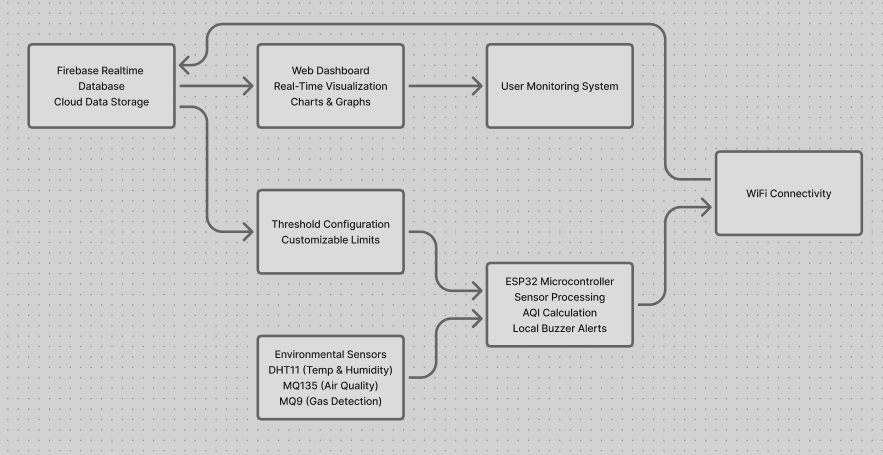
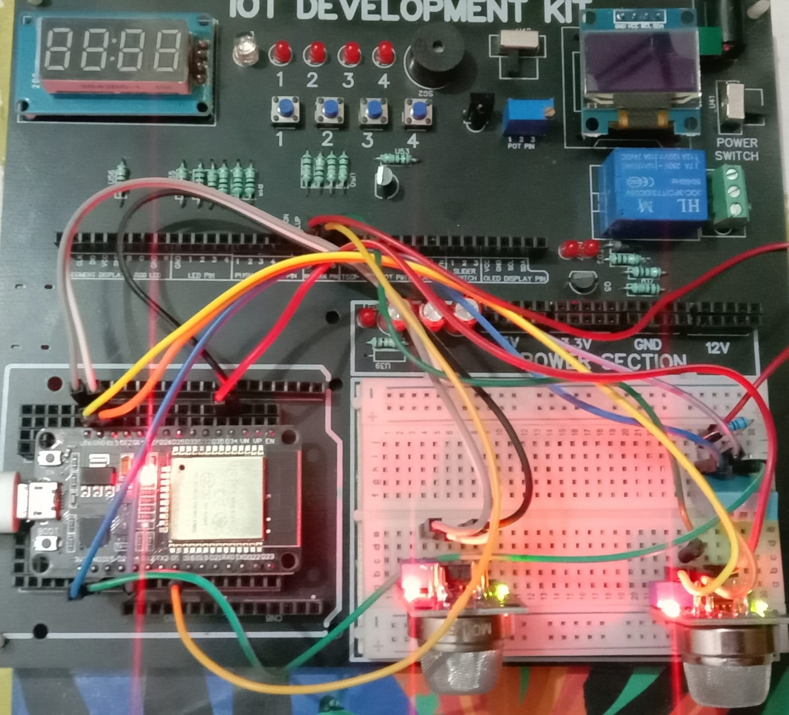
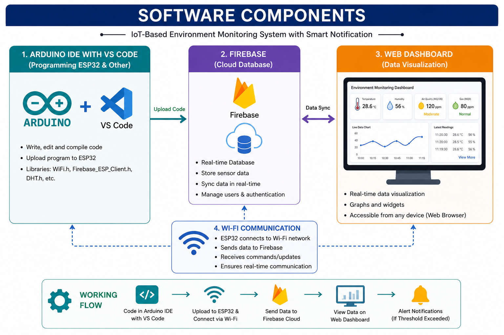
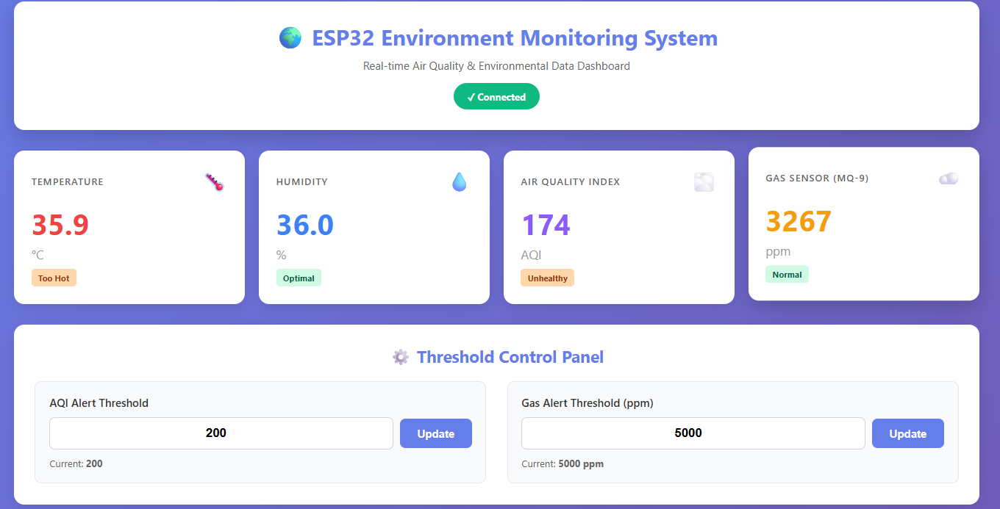
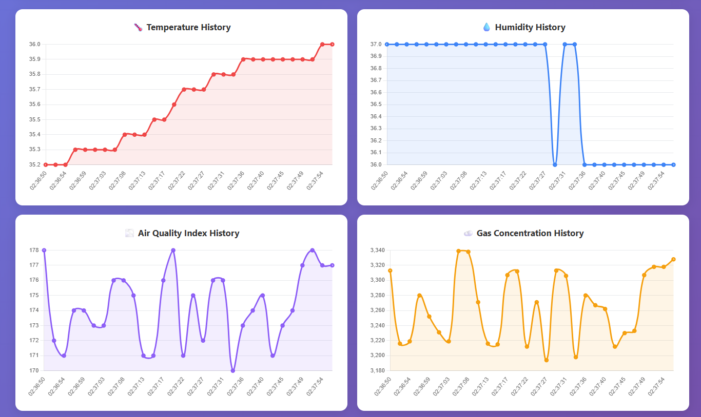
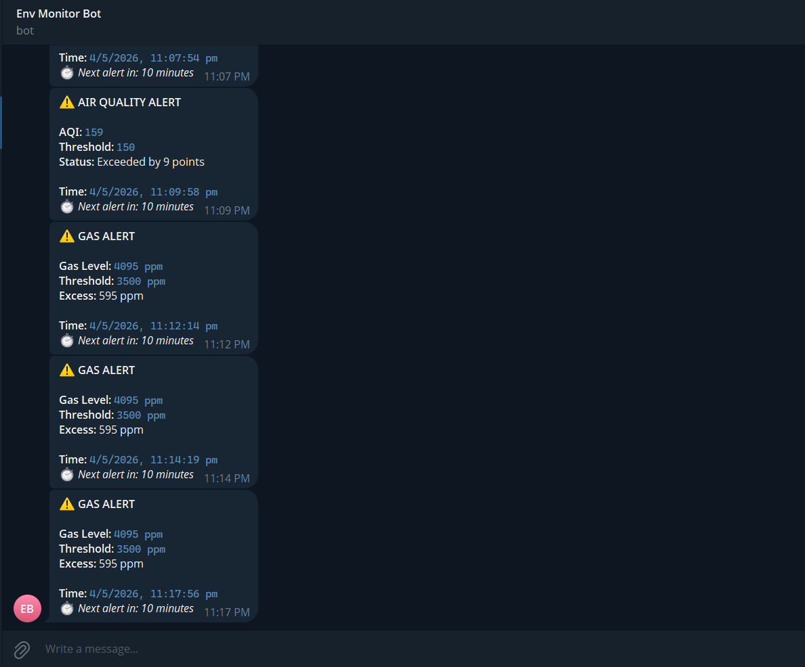
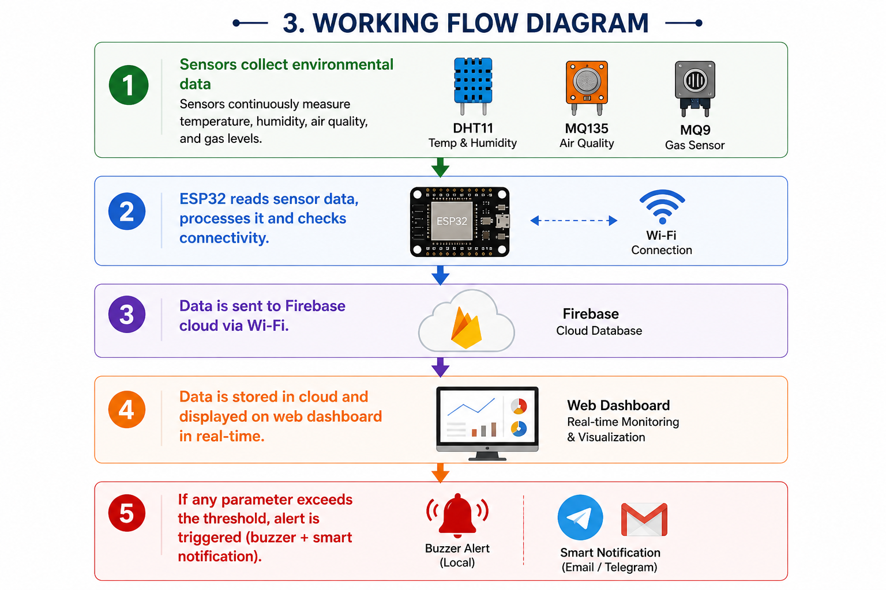

# 🌍 Environment Monitoring System (EMS)

An **IoT-based real-time environmental monitoring system** using ESP32 microcontroller to measure air quality, temperature, and gas levels with cloud integration, web dashboard, and Telegram alerts.

---

## ✨ Key Features

- 🌡️ **Real-time Monitoring**: Track temperature, humidity, and air quality index (AQI)
- 💨 **Gas Detection**: Monitor CO and dangerous gases using MQ-135 and MQ-9 sensors
- 📊 **Web Dashboard**: Beautiful, responsive interface to visualize sensor data in real-time
- 📱 **Telegram Alerts**: Instant notifications when thresholds are exceeded
- ☁️ **Firebase Cloud**: Secure cloud storage and real-time database sync
- 📈 **Data Analytics**: Charts and graphs for historical data analysis
- 🔐 **Secure**: Protected credentials with environment variables
- 📡 **WiFi Connected**: Real-time data sync over WiFi

---

## 🏗️ System Architecture

### Overall System Flow


### Detailed Architecture Diagram


### Methodology Overview


---

## 📋 Hardware Requirements

### Microcontroller & Sensors
- **ESP32** - Main microcontroller
- **DHT11** - Temperature & Humidity sensor
- **MQ-135** - Air quality sensor (detects ammonia, NOx, etc.)
- **MQ-9** - Carbon monoxide sensor
- **Jumper wires** - For connections
- **Breadboard** - For circuit assembly

### Circuit Diagram
.png)

### Real Hardware Setup


The image above shows a real implementation with:
- ✅ ESP32 microcontroller (center - red board)
- ✅ DHT11 sensor (temperature & humidity)
- ✅ MQ-9 sensor (CO detection - gas sensor on right)
- ✅ Colored jumper wires for connections
- ✅ Power and GND connections properly wired

---

## 💻 Software Requirements



The system uses:
- **Arduino IDE** or **PlatformIO** - For ESP32 programming
- **Firebase Console** - Cloud database setup
- **Telegram Bot API** - For alert notifications
- **Node.js** - For backend alert service
- **Web Browser** - For dashboard access
- **Git** - For version control

As shown in the diagram above:
1. **Arduino IDE/VS Code** - Write and compile ESP32 code
2. **Firebase** - Cloud database for sensor data storage
3. **Web Dashboard** - Real-time data visualization
4. **WiFi Communication** - ESP32 connects via WiFi to sync data


---

## 🚀 Quick Start (5 Minutes)

### 1. Clone the Repository
```bash
git clone https://github.com/sudhirskp/Environment-Monitoring-System.git
cd Environment-Monitoring-System/es
```

### 2. Copy Configuration Files
```bash
# Copy environment variables template
cp .env.example .env

# Copy Arduino secrets template
cp src/secrets.h.example src/secrets.h

# Copy Firebase config template
cp web/firebase-config.example.js web/firebase-config.js
```

### 3. Update Your Credentials
Edit the following files with your actual credentials:

**Edit `.env`:**
```bash
notepad .env
```

**Edit `src/secrets.h`:**
```bash
notepad src/secrets.h
```

**Edit `web/firebase-config.js`:**
```bash
notepad web/firebase-config.js
```

### 4. Upload to ESP32
- Connect ESP32 via USB
- Open `src/check_the_base.cpp` in Arduino IDE or PlatformIO
- Compile and upload
- Open Serial Monitor (115200 baud) to verify

### 5. Run Web Dashboard
- Open `web/index.html` in your browser
- See live sensor data appear on the dashboard!

---

## 📖 Detailed Installation Guide

### Step 1: Setup Firebase Project

1. Go to [Firebase Console](https://console.firebase.google.com)
2. Create a new project: "ems-iot-system"
3. Go to **Realtime Database** → Create Database
4. Copy your credentials:
   - API Key
   - Database URL
   - Project ID
   - Messaging Sender ID
   - App ID

### Step 2: Setup Telegram Bot

1. Open Telegram and search for **@BotFather**
2. Create new bot: `/newbot`
3. Get your **Bot Token**
4. Start a chat with your bot and get your **Chat ID**

### Step 3: Configure ESP32

1. Open `src/secrets.h`:
```cpp
#define WIFI_SSID "YOUR_WIFI_NAME"
#define WIFI_PASSWORD "YOUR_WIFI_PASSWORD"
#define FIREBASE_API_KEY "YOUR_API_KEY"
#define TELEGRAM_BOT_TOKEN "YOUR_BOT_TOKEN"
#define TELEGRAM_CHAT_ID "YOUR_CHAT_ID"
```

2. Install required libraries in Arduino IDE:
   - Firebase ESP Client
   - DHT sensor library
   - ArduinoJson

### Step 4: Setup Node.js Backend (Optional)

```bash
npm install
npm start
```

Or use PM2 for production:
```bash
npm install -g pm2
pm2 start telegram-alert-service.js --name "ems-alerts"
pm2 save
```

### Step 5: Access Web Dashboard

Open `web/index.html` in your browser to see real-time data!

---

## 📊 Web Dashboard

### Main Dashboard


### Data Analytics


The dashboard displays:
- ✅ Real-time temperature & humidity
- ✅ Air Quality Index (AQI)
- ✅ Gas levels (CO detection)
- ✅ Historical data charts
- ✅ Connection status
- ✅ Alert notifications

---

## 🔔 Telegram Notifications

### Alert System Flow


### Sample Alert


Alerts are sent when:
- 🔴 AQI exceeds 300
- 🔴 Gas levels exceed 2500 ppm
- 🟡 WiFi disconnection detected
- 🟡 Firebase sync issues

---

## 📁 Project Structure

```
Environment-Monitoring-System/
├── es/                              # Main project folder
│   ├── src/
│   │   ├── check_the_base.cpp      # Main ESP32 firmware
│   │   └── secrets.h               # Credentials (keep secret!)
│   ├── lib/
│   │   └── TelegramAlert.h         # Telegram integration
│   ├── web/
│   │   ├── index.html              # Dashboard HTML
│   │   ├── dashboard.css           # Dashboard styling
│   │   ├── dashboard.js            # Dashboard logic
│   │   └── firebase-config.js      # Firebase configuration
│   ├── telegram-alert-service.js   # Node.js alert service
│   ├── .env                        # Environment variables (secret!)
│   ├── .env.example                # Template for .env
│   ├── package.json                # Node.js dependencies
│   ├── platformio.ini              # PlatformIO config
│   └── README.md                   # This file
├── images/                          # Diagrams and screenshots
└── firebase-service-account.json   # Firebase admin key (secret!)
```

---

## ⚙️ Configuration

### Environment Variables (`.env`)

```env
# Firebase Web Configuration
FIREBASE_API_KEY=your_api_key_here
FIREBASE_AUTH_DOMAIN=your_project.firebaseapp.com
FIREBASE_DATABASE_URL=https://your-db.firebasedatabase.app
FIREBASE_PROJECT_ID=your_project_id

# ESP32 Configuration
WIFI_SSID=your_wifi_name
WIFI_PASSWORD=your_wifi_password

# Telegram Configuration
TELEGRAM_BOT_TOKEN=your_bot_token
TELEGRAM_CHAT_ID=your_chat_id

# Alert Settings
AQI_ALERT_THRESHOLD=300
GAS_ALERT_THRESHOLD=2500
ALERT_COOLDOWN_MINUTES=10
```

### Arduino Secrets (`src/secrets.h`)

```cpp
#define WIFI_SSID "YOUR_WIFI_NAME"
#define WIFI_PASSWORD "YOUR_WIFI_PASSWORD"
#define FIREBASE_API_KEY "YOUR_API_KEY"
#define FIREBASE_DATABASE_URL "YOUR_DB_URL"
#define FIREBASE_USER_EMAIL "your_email@gmail.com"
#define FIREBASE_USER_PASSWORD "your_password"
#define TELEGRAM_BOT_TOKEN "YOUR_BOT_TOKEN"
#define TELEGRAM_CHAT_ID "YOUR_CHAT_ID"
```

---

## 🔄 Workflow

### Complete System Flow


### Data Flow:
1. **ESP32** reads sensor data
2. **Sends to Firebase** via WiFi
3. **Web Dashboard** receives updates in real-time
4. **Alert Service** monitors thresholds
5. **Sends Telegram notification** if threshold exceeded
6. **User receives alert** on their phone

---

## 🧪 Testing & Verification

### Test ESP32 Connection
```bash
# Open serial monitor in Arduino IDE
# Should see output like:
# ✓ WiFi Connected!
# ✓ Firebase Connected Successfully!
```

### Test Web Dashboard
```bash
# Open browser console (F12)
# Should see:
# ✓ Firebase configuration loaded successfully!
# ✓ Connected to database
```

### Test Telegram Alerts
```bash
# Simulate high AQI
# Should receive alert: "⚠️ Alert: AQI Level 350 - Unhealthy for Sensitive Groups"
```

---

## 🐛 Troubleshooting

| Issue | Solution |
|---|---|
| **WiFi won't connect** | Check SSID/password in `secrets.h` and `.env` |
| **Firebase connection fails** | Verify API key and database URL are correct |
| **No data on dashboard** | Check browser console for errors (F12) |
| **Telegram not working** | Verify bot token and chat ID, check internet connection |
| **Arduino won't upload** | Check USB cable, select correct board (ESP32) and COM port |
| **Sensor readings are 0** | Verify sensor connections, check circuit diagram |

---

## 📚 Detailed Guides

- 📖 [WiFi Implementation Guide](STEP1_WiFi_IMPLEMENTATION.md)
- 🔥 [Firebase Setup Guide](STEP2_FIREBASE_IMPLEMENTATION.md)
- 🎯 [Dynamic Thresholds Guide](STEP3_DYNAMIC_THRESHOLDS.md)
- 🌐 [Web Dashboard Guide](STEP4_WEB_DASHBOARD.md)
- 📱 [Telegram Setup Guide](TELEGRAM_SETUP_QUICK_START.md)

---

## 📊 Data Storage

### Firebase Realtime Database Structure
```json
{
  "environment_data": {
    "timestamp": 1234567890,
    "temperature": 28.5,
    "humidity": 65,
    "aqi": 150,
    "co_level": 45
  },
  "alerts": {
    "alert_id": {
      "type": "AQI_HIGH",
      "message": "AQI Level 350 - Unhealthy",
      "timestamp": 1234567890
    }
  }
}
```

---

## 🎯 Future Enhancements

- [ ] Multiple sensor locations
- [ ] Mobile app (iOS/Android)
- [ ] Machine learning predictions
- [ ] Email notifications
- [ ] Data export (CSV/PDF)
- [ ] Advanced analytics dashboard
- [ ] Multi-user support with authentication
- [ ] Historical data archival

---

## 🤝 Contributing

Contributions are welcome! Please:

1. Fork the repository
2. Create a feature branch (`git checkout -b feature/amazing-feature`)
3. Commit changes (`git commit -m 'Add amazing feature'`)
4. Push to branch (`git push origin feature/amazing-feature`)
5. Open a Pull Request

---

## 📄 License

This project is licensed under the MIT License - see the [LICENSE](LICENSE) file for details.

---

## 📞 Support & Contact

- 📧 Email (Go through it and send mail): https://portfolio-website-bqj5.onrender.com/
- 🐙 GitHub: [@sudhirskp](https://github.com/sudhirskp)
- 💬 Issues: [Report Issues](https://github.com/sudhirskp/Environment-Monitoring-System/issues)

---

## 📝 Changelog

### v1.0 - Initial Release
- ✅ ESP32 sensor integration
- ✅ Firebase cloud sync
- ✅ Web dashboard
- ✅ Telegram alerts
- ✅ Real-time data monitoring

---

## 🙏 Acknowledgments

- [Firebase](https://firebase.google.com) - Cloud database
- [Telegram Bot API](https://core.telegram.org/bots/api) - Alert notifications
- [Arduino Community](https://www.arduino.cc/) - ESP32 libraries
- [DHT Sensor Library](https://github.com/adafruit/DHT-sensor-library) - Temperature readings
- [Firebase ESP Client](https://github.com/mobizt/Firebase-ESP-Client) - Firebase integration

---

## 📈 Project Stats

- ⭐ Stars: [Check on GitHub]
- 🔀 Forks: [Check on GitHub]
- 🐛 Issues: [Check on GitHub]
- 📦 Release: v1.0

---

**Made with ❤️ for Environmental Monitoring**

*Last Updated: May 2026*
